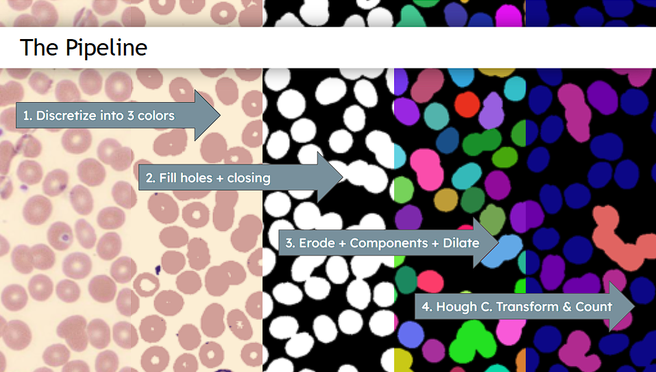

# Roleaux

This project is designed to detect *Rouleaux* formations among red blood cells using classical computer vision techniques.

## Main Functionalities

### The Algorithm


1. **Rough Pixelwise Masking**: Classifies each pixel as a Red Blood Cell (RBC), White Blood Cell (WBC), or Background using its own color:
    * As all colors in the image are close to a blend of the RBC's pinkish color, the WBC's purple color, and the background's beige color, the pipeline starts by projecting every pixel's color into the plane defined by the three main colors.
    * Then, it performs a barycentric split of the plane into three regions that get assigned to each color. The parameters of this split, as well as the main color values, can be adjusted and optimized by the user interactively with the [Color Visualizer App](##Interactive-Color-Visualizer).
2. **Red Blood Cell Masking**: After the initial pixelwise masking, the pipeline fills holes from red blood cell regions, and performs a morphological opening to remove noise and smooth the cell boundaries. 3. **Separation into blobs**: the algorithm now retrieves the different connected components from the previous mask. This is preceded by an erosion (to split touching cells that are not rouleaux) and followed by a dilation algorithm (to grow back the cell mask to its original form)
4. **Cell counting**: For each cluster detected above, the algorithm performs a Hough Circle Transform to estimate the number of cells in the cluster. The threshold for the Hough Transformed will be determined by the area of the cluster itself: larger clusters (which are likely to be made of multiple red blood cells) will have lower thresholds than smaller ones to detect cells whose boundary is barely present in the cluster's perimeter.  

### Interactive Color Visualizer

A small HTML app that allows the user to find the three main colors of the image and tune the parameters of the barycentric split for the rough pixelwise masking in Step 1. It can be found in `interactives/color_visualizer/`.

### Cluster Labeler

A small HTML app that allows the user to label the number of red blood cells in each cluster detected in Step 3. It can be found in `interactives/cluster_labeler/`. These labels can be used as the ground truth for evaluating the performance of the rouleaux detection algorithm.

## Project Structure

* `image.py`: The `Image` class for handling image I/O, format conversions, and version tracking.
* `processor.py`: The `Processor` abstract for image manipulation, as well as base classes for geometric projections, (e.g. `PlaneProjection`, `TriangleProjection`).
* `cells.py`: Core logic for cell masking, cluster segmentation (`RBClusters`), and counting (`ClusterCountMask`).
* `geometry.py`: Core math functions for projections and barycentric splitting.
* `interactives/color_visualizer/`: The HTML/JS canvas app for interactive color space exploration.
* `interactives/cluster-labeler/`: The HTML/JS app for creating ground-truth labels of RBC clusters.
* `configs/`: Stores JSON configurations (`triangle.json`) and the Conda environment file.
* `main.ipynb`: A central Jupyter Notebook for running experiments, visualizing results, and calculating the algorithm's performance metrics.

## Quickstart Guide

### 1. Prerequisites
Ensure you have [Conda](https://docs.conda.io/en/latest/miniconda.html) installed on your system.

### 2. Environment Setup
Create and activate the specialized Conda environment using the provided configuration:
```bash
conda env create -f configs/environment.yaml
conda activate roleaux
```

### 3. Usage
**Data Analysis:**
To run the automated pipeline or explore the data, launch Jupyter Lab and open the main notebook:
```bash
jupyter lab main.ipynb
```

**Color Parameter Tuning:**
To interactively calibrate the cell masking parameters:
1. Open `interactives/color_visualizer/index.html` in a web browser.
2. Upload a sample image, adjust the three main vertices colors (for Red Blood Cells, White Blood Cells, and Background) 
3. Tune the draggable vertices that determine the barycentric split of the color space. 
4. Visualize the resulting rough mask by selecting the "Plane Mask" overlay in the dropdown menu.
5. Export your configuration and save it into `configs/triangle.json`.

**Cluster Ground-Truth Labeling:**
To build validation datasets of correctly labeled cell clusters:
1. Navigate to `interactives/cluster-labeler/` and open `index.html`.
2. Load the cropped cluster images generated by the pipeline. You can also load the machine output labels to use as a reference while labeling.
3. Use the interface to quickly annotate the cell composition (e.g., entering `1, 1, 3` denotes a 1-cell, 1-cell, and 3-cell cluster).
4. Export your labels to save them as a JSON dataset.
